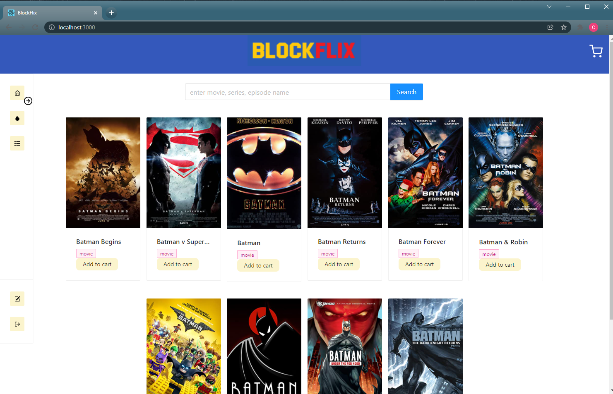

  

# Blockflix 

## Table of Contents 
[Description](#description)  
[Technologies](#technologies)  
[Usage/Link](#usage)  
[License](#licensing)  
[Collaborators](#collaborators)  

## Description
This appliation allows users to search for movies and shop by adding to cart. 

## Technologies
React-front end
GraphQL with Node.js and Express.js server
MongoDB- database
OMBb API-RESTful web service to get movie info 

## Usage
You can access the deployed application here: . 

After navigating to the application, users open to the home page. 
 
From the home screen users are able to browse movies by using the search bar. Using the side bar, using can create a sign in and log in to add movies to cart using the 'Add to cart' button. Users can access their cart by clicking the cart icon in the top right corner of the screen. 
The side bar allows gives user access to browse popular movies and their order history when logged in. 

## Licensing
Licensed under [MIT license](LICENSE). 

## Collaborators
Phon Phongsavath
Anthony Korneagay Jr
Cameron White
Samira Abdalla
Jonathan Taylor
